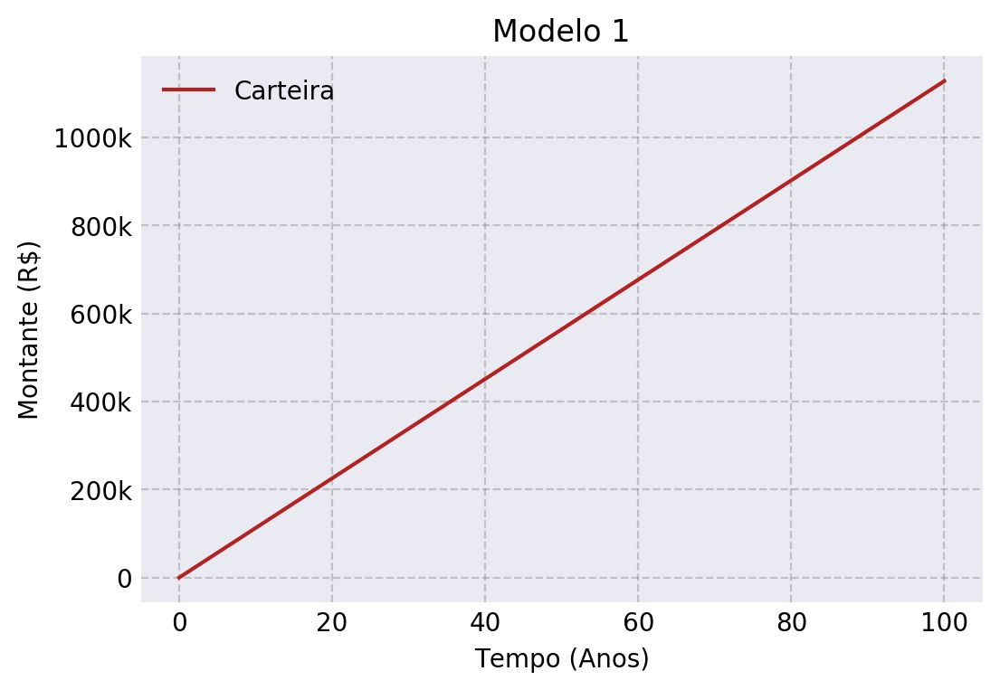
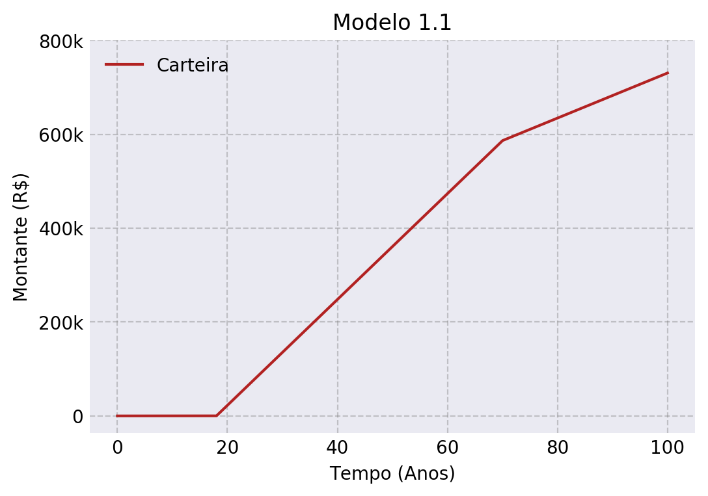
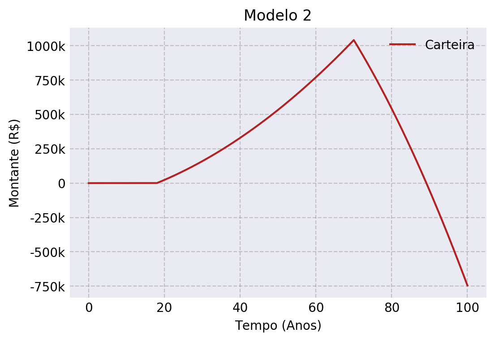

# Finanças Simuladas - EDOs
[](https://colab.research.google.com/github/Cristianobam/blog-post/blob/master/docs/simulacoes/FinancesSimulation.ipynb)

[](https://nbviewer.jupyter.org/github/Cristianobam/blog-post/blob/master/docs/simulacoes/FinancesSimulation.ipynb)


**\*\*Disclaimer**

Antes de mais nada, vale dizer que minha formação não é voltada para econômia. Mesmo que no curso de engenharia tenhamos disciplinas como engenharia econômica, ela não fornece uma visão macroscópica e nem o a base suficiente para criar modelos econômicos que se apliquem ao mercado financeiro. Tendo posto isso, esse post foca mais na utilização de equações diferenciais e suas interpretações assim como a programação matemática por trás.

Durante o post e ao fim dele terão algumas referências para o aprofundamento em econômia de fato bem como os outros conceitos matemáticos. Vale ressaltar que esses modelos não devem ser levados ao pé da letra, mas nos trazem algumas intuições sobre o assunto.

## Introdução

Lembra do caso Bettina, "Oi, eu sou a Bettina e tenho 1 milhão e 42 mil reais em patrimônio acumulado..." ? Bem, esse tipo propaganda super apelativa fingem que a independência financeira é algo bem direto e fácil. Porém, não são. Esse caminho no geral envolve uma série de fatores a serem levados em consideração e que dificultam muito o raciocínio lógico.

Nesse post, a ideia é tentar modelar esse problema econômico com um pouco de matemática e programação. Dessa forma, construiremos uma carteira financeira utilizando algumas equações diferenciais ordinárias (**EDOs**) e alguns scripts para integrar e visualizar as dinâmicas.

## O Problema

Na grande maioria dos problemas naturais podemos avaliá-los de duas maneiras diferentes.

A primeira maneira é verificar, neste exemplo de uma carteira financeira, *quanto dinheiro temos num dado tempo*. A segunda maneira - e a que usaremos - é verificar *quanto o dinheiro muda com o tempo*. Dessa forma, sabendo a primeira derivada, $\frac{dx}{dt}$, e a condição inicial, $x_0 = x(0)$, conseguimos calcular os bens futuros. Assim, para encontramos $x(t)$ que satisfaça a nossa EDO, basta integramos

$$x(t) = \int_0^t \dfrac{dx}{dt} dt$$

### 1ª Modelagem

Vamos começar com um caso simples. Nossas finanças são baseadas nos seguintes fatores:

- Nossa renda mensal, $r(t)$.
- Todas as nossas despesas (contas, alimentação, moradia, etc), $d(t)$.
- As taxas que você paga sobre o seu salário, $T(a)$.

Dessa forma podemos dizer que o seu ganho, i.e., a taxa com que você ganha ou perde dinheiro pode ser escrita como

$$\delta = r(t) - d(t) - T(a)$$

Neste caso, $\delta$ é o seu ganho. Assim, a EDO pode ser escrita como

$$\dfrac{dx}{dt} = \delta$$

Dados $r(t)$, $d(t)$ e $T(a)$ constantes, podemos resolver integrando facilmente

$$\int_{x_0}^{x(t)} dx = \int_0^t \delta~dt \Rightarrow x(t) = \delta t + x_0$$


Como mantemos tudo constante, nossa equação final será uma reta. Transformando a matemática em código teremos o seguinte:

```python linenums="1"
class Carteira:
    def __init__(self, salario=1600, despesas=500, taxas=.1):
        self.salario = salario
        self.despesas = despesas
        self.taxas = taxas
    
    def ganho(self, t):
        return 12 * self.salario
    
    def gastos(self, t):
        return 12 * self.despesas
    
    def pagamentos(self, t):
        return self.taxas * self.ganho(t)
    
    def modelo(self, t):
        return self.ganho(t) - self.gastos(t) - self.pagamentos(t)
    
    def integrar(self, t_init, t_end, y0, h=0.001):
        N = int((t_end - t_init) / h)
        x = np.linspace(t_init, t_end, N)
        y = np.zeros(N)
        y[0] = y0
        for i in range(N-1):
            y[i+1] = y[i] + h * self.modelo(x[i])
        return x, y
```

Com um salário de 1600 reais, despesas de 500 reais e os descontos salariais de 10%, teremos a reta abaixo. Vale dizer que a granularidade temporal é de um ano. Para integrar a nossa EDO, ao invés de usar um pacote pronto, escrevemos a função `#!python integrar()`. Essa função é a implementação do método de Euler para resolver EDOs - veja mais [aqui][1].

[1]: http://cristianobam.github.io/calculo-numerico/

<div class="img-center">
    
</div>

Parando para ver o nosso modelo, não faz sentido pensarmos que desde que nascemos ganhemos um salário. Além disso, todos queremos nos aposentar um dia. No nosso modelo, trabalhamos até morrer aos 100 anos. Bem, fica difícil viver até os 100 trabalhando desde o nascimento... Vamos introduzir isso ao modelo!

### 1ª Modelagem + Descontinuidades 

Como a integral é um operador linear - uma maneira bonitinha de dizer que a integral da soma é a soma das integrais. Dessa forma, é válido fazermos a seguinte operação:

$$x(t) = \int_{nascimento}^{t_1} \dfrac{dx}{dt}~dt + \int_{t_1}^{t_2} \dfrac{dx}{dt}~dt + \int_{t_2}^{morte} \dfrac{dx}{dt}~dt$$

Dessa forma teremos 3 momentos distintos nas nossas vidas

- Infância: quando somos dependentes dos nossos pais e não temos um salário e nem despesas.
- Vida Ativa: quando ganhamos, gastamos e pagamos taxas.
- Aposentadoria: quando não temos mais um salário, mas ganhamos uma aposentadoria que é menor que o nosso salário. Além disso ainda temos despesas e taxas.


Nosso código muda um pouco. Vamos acrescentar essas descontinuidades ao ganho e aos gastos. Para integrar esse modelos agora, definimos uma função simulação. Nela executamos integramos passo a passo cada um dos estágios.

```python linenums="1" hl_lines="3 7 8 9 11 12 13 14 15 16 17 19 20 21 22 23"
class Carteira:
    def __init__(self, salario=1600, despesas=500, taxas=.1,
                aposentadoria=1000, atividade=18, descanso=70):
        self.salario = salario
        self.despesas = despesas
        self.taxas = taxas
        self.aposentadoria = aposentadoria
        self.atividade = atividade
        self.descanso = descanso
    
    def ganho(self, t):
        if t < self.atividade:
            return 0
        elif self.atividade <=  t < self.descanso:
            return 12 * self.salario
        else:
            return 12 * self.aposentadoria

    def gastos(self, t):
        if t < self.atividade:
            return 0
        else:
            return 12 * self.despesas
    
    def pagamentos(self, t):
        return self.taxas * self.ganho(t)
    
    def modelo(self, t):
        return self.ganho(t) - self.gastos(t) - self.pagamentos(t)
    
    def integrar(self, t_init, t_end, y0, h=0.001):
        N = int((t_end - t_init) / h)
        x = np.linspace(t_init, t_end, N)
        y = np.zeros(N)
        y[0] = y0
        for i in range(N-1):
            y[i+1] = y[i] + h * self.modelo(x[i])
        return x, y

def simulacao(carteira):
    x0, y0 = carteira.integrar(0, carteira.atividade, 0)
    x1, y1 = carteira.integrar(carteira.atividade, carteira.descanso, y0[-1])
    x2, y2 = carteira.integrar(carteira.descanso, 100, y1[-1])
    return np.concatenate((x0,x1,x2)), np.concatenate((y0,y1,y2))
```

<div class="img-center">
    
</div>

Mesmo com a função $\frac{dx}{dt}$ tendo uma série de descontinuidades, a função $x(t)$

### 2ª Modelagem

Bem, a menos que sejamos alunos de iniciação científica, nós esperamos que o nosso salário aumente em função do tempo. Além disso, é fácil pensarmos que nossos gastos também aumentaram em função do tempo. 

$$\begin{cases}
r(t) =  \alpha~t + r_0\\
d(t) = \beta~t + d_0\\
\end{cases}$$

Neste caso, $\alpha$ é a taxa de aumento salarial, ou o reajuste salarial, e $\beta$ o aumento das despesas, ou o reajuste de despesas. Agora nossa função $\delta$ será dependente do tempo. Esta dependência temporal na derivada primeira trará um perfil quadrático na função $x(t)$. 

```python linenums="1" hl_lines="4 11 12 18 19 27 28"
class Carteira:
    def __init__(self, salario=1600, despesas=500, taxas=.1,
                aposentadoria=1000, atividade=18, descanso=70,
                alpha=120, beta=80):
        self.salario = salario
        self.despesas = despesas
        self.taxas = taxas
        self.aposentadoria = aposentadoria
        self.atividade = atividade
        self.descanso = descanso
        self.reajuste_salarial = alpha
        self.reajuste_despesas = beta
    
    def ganho(self, t):
        if t < self.atividade:
            return 0
        elif self.atividade <=  t < self.descanso:
            return 12 * (self.salario + self.reajuste_salarial\
                 * (t - self.atividade))
        else:
            return 12 * self.aposentadoria

    def gastos(self, t):
        if t < self.atividade:
            return 0
        else:
            return 12 * (self.despesas + self.reajuste_despesas\
                 * (t - self.atividade))
    
    def pagamentos(self, t):
        return self.taxas * self.ganho(t)
    
    def modelo(self, t):
        return self.ganho(t) - self.gastos(t) - self.pagamentos(t)
    
    def integrar(self, t_init, t_end, y0, h=0.001):
        N = int((t_end - t_init) / h)
        x = np.linspace(t_init, t_end, N)
        y = np.zeros(N)
        y[0] = y0
        for i in range(N-1):
            y[i+1] = y[i] + h * self.modelo(x[i])
        return x, y

def simulacao(carteira):
    x0, y0 = carteira.integrar(0, carteira.atividade, 0)
    x1, y1 = carteira.integrar(carteira.atividade, carteira.descanso, y0[-1])
    x2, y2 = carteira.integrar(carteira.descanso, 100, y1[-1])
    return np.concatenate((x0,x1,x2)), np.concatenate((y0,y1,y2))
```

<div class="img-center">
    
</div>

Como podemos ver, a nossa função exibe o perfil quadrático que previmos anteriormente. Além disso, vemos grandes diferenças nos resultados das integrações. E bem, como estamos devendo, talvez seja hora de começarmos a investir para sairmos desse vermelho.

### 3ª Modelagem

Agora chegou aquele momento de lembrarmos das aulas de engenharia econômica e da mágica dos juros compostos. A fórmula para isso é fácil

$$M = C\cdot(1+i)^n$$

onde, $M$ é o montante, $C$ o capital inicial, $i$ a taxa de juros compostos e $n$ o período de aplicação. A "mágica" dos juros compostos na verdade é a aplicação de juros sobre juros, ou seja, é como se pegássemos tudo o que já ganhamos e investíssemos novamente sobre o mesmo regime de juros.

Mas vamos lembrar que estamos trabalhando com EDOs, assim vamos tomar a derivada dessa equação:

$$\begin{cases}
x(t) = x_0(1+i)^t\\
\dfrac{dx}{dt} = x_0(1+i)^t\ln{(R+1)} = x(t)\ln{(R+1)}
\end{cases}$$

Como podemos ver, a derivada da função juros composto é proporcional a ela mesma. 

Agora é onde tudo fica ainda mais interessante. 